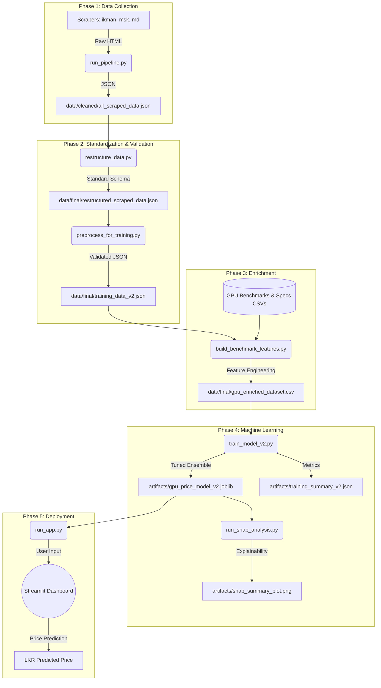

# GPU Price Prediction MVP

This project predicts the **used market price of a GPU in Sri Lankan Rupees (LKR)** using data scraped from multiple Sri Lankan sources.

The goal of this MVP is simple:

- collect real GPU listing data
- clean and merge it into one training dataset
- train a machine learning model
- show the prediction through a small web app

## 📚 Documentation Quick Links

**For detailed explanations, read [MODEL_DOCUMENTATION.md](MODEL_DOCUMENTATION.md):**

- ✅ **How models are trained and why** - Complete training workflow with hyperparameter tuning
- 🎯 **How the model predicts prices** - Step-by-step prediction process with examples
- 🔍 **Predicting without marketplace data** - Technical specifications lookup fallback
- 📊 **Validating predictions** - Evaluation metrics, cross-validation, and confidence intervals

**For the new fairness score feature, read [FAIRNESS_SCORE_GUIDE.md](FAIRNESS_SCORE_GUIDE.md):**

- 💰 **Fair Price Checker** - Enter your GPU price to check if it's reasonably priced
- 📈 **Fairness Interpretation** - Understand scores from 0-100%
- 🎯 **Real examples** - See how fairness works in practice

## Project Structure

```text
Scrapper/
|-- artifacts/
|   |-- gpu_price_model.joblib          # Selected best model for app
|   |-- gpu_training_dataset.csv        # Merged training data
|   |-- model_metrics.json              # Full benchmark results & metadata
|   `-- model_comparison.csv            # Comparison table of all models
|-- data/
|   |-- cleaned/
|   `-- raw/
|-- scrapers/
|   |-- ikman_used_gpus_scraper.py
|   |-- md_used_gpus_scraper.py
|   `-- msk_used_gpus_scraper.py
|-- scripts/
|   |-- run_app.py
|   `-- train_model.py
|-- src/
|   `-- gpu_price_predictor/
|       |-- __init__.py
|       |-- app.py
|       `-- pipeline.py
|-- requirements.txt
`-- README.md
```

## What Each Folder Does

- `data/raw`: raw listings exactly as scraped from the websites
- `data/cleaned`: cleaned GPU listings used as the input to model training
- `scrapers`: scripts that collect data from Ikman, MSK, and MD Computers
- `src/gpu_price_predictor/pipeline.py`: the main ML data pipeline logic
- `scripts/train_model.py`: trains the model and saves output artifacts
- `src/gpu_price_predictor/app.py`: Streamlit prediction UI logic
- `scripts/run_app.py`: small launcher used to run the app easily
- `artifacts`: files produced after training

## Data Sources

The current MVP trains using cleaned data from:

- `ikman`
- `mskcomputers`
- `mdcomputers`

These are combined into one dataset so the prediction is based on **all sources together**, not just one website.

## How It Works

This is the part you can explain to your lecturer.

### 1. Data collection

Each scraper collects used GPU listing data from one website.

Examples of collected fields:

- title
- price
- stock status
- source website
- brand or manufacturer if available
- VRAM if available

The raw files are saved in `data/raw`.

### 2. Data cleaning

The cleaned files in `data/cleaned` keep only the useful information needed for machine learning.

During cleaning, the system:

- converts prices into numeric `LKR`
- extracts GPU models such as `GTX 1650`, `RTX 3060 TI`, `RX 580`
- extracts VRAM like `4GB`, `8GB`
- keeps stock status and brand when available
- fills missing fields with `Unknown` instead of hardcoding fake values

### 3. Dataset merging

The training pipeline reads the three cleaned JSON files and merges them into one table.

The final training table contains features like:

- `model`
- `vram_gb`
- `manufacturer`
- `source`
- `stock`
- `brand`
- `location`
- `series_family`
- `model_number`

This merged dataset is saved as:

`artifacts/gpu_training_dataset.csv`

### 4. Feature engineering

The model does not learn directly from the raw title alone.
Instead, the pipeline creates structured features from the title and cleaned fields.

For example:

- `GTX 1050 TI` becomes a normalized model
- `GTX` becomes the series family
- `1050` becomes the model number
- `4GB` becomes numeric VRAM

This is important because machine learning works better when the data is structured and consistent.

### 5. Model training

The training script performs a comprehensive benchmark of multiple regression models:

**Candidate Models:**

- `baseline_median_by_model`: Simple baseline using median price by GPU model
- `LinearRegression`: Basic linear model
- `Ridge`: Regularized linear regression
- `RandomForestRegressor`: Ensemble of decision trees
- `ExtraTreesRegressor`: Randomized forest ensemble
- `GradientBoostingRegressor`: Gradient boosting ensemble
- `HistGradientBoostingRegressor`: Histogram-based gradient boosting
- `XGBoostRegressor`: Extreme gradient boosting (if available)
- `LightGBMRegressor`: Light gradient boosting (if available)

**Evaluation Metrics:**

- `MAE` (Mean Absolute Error) - primary selection metric
- `RMSE` (Root Mean Square Error)
- `MAPE` (Mean Absolute Percentage Error)
- 5-fold cross-validation scores for robustness assessment

The script trains all available models on the same train/test split, evaluates their performance, and automatically selects the best model by MAE. The selected model is saved for production use.

**Optional Dependencies:**

- XGBoost and LightGBM are included if installed
- If unavailable, they are marked as "unavailable" in benchmark results
- Training continues gracefully without them

This approach ensures the system uses the best available model while providing comprehensive benchmarking data for research purposes.

### 6. Prediction

When a user opens the app and enters GPU details:

- model
- VRAM
- optional brand/manufacturer
- optional stock status

the app builds the same feature structure used during training and sends it into the saved model.

The app then returns:

- predicted price in LKR
- estimated price range based on model error

If the user chooses `Any` for brand or stock:

- the app predicts across all matching combinations
- then averages those predictions

So the result still comes from the ML model, not from hardcoded fallback values.

## Why This Is Machine Learning

This project is ML because:

- it learns patterns from historical data
- it uses features extracted from real listings
- it evaluates model performance on unseen test data
- it saves the trained model and reuses it for prediction

It is not a hardcoded system because:

- prices are not manually mapped to GPU names
- the app prediction comes from the trained model artifact
- changing the dataset and retraining can change the prediction behavior

## Benchmarking Results

After training, the system provides comprehensive benchmarking data:

**model_comparison.csv** contains:

- Model name and training status
- Holdout test metrics (MAE, RMSE, MAPE)
- 5-fold cross-validation scores (mean ± std)
- Clear indication of which models were available vs unavailable

**model_metrics.json** includes:

- Selected model and selection criteria
- Dataset statistics (train/test split sizes)
- Full evaluation results for all models
- Cross-validation scores for robustness assessment
- Training timestamp and metadata

The app sidebar displays:

- Selected model name
- Number of models compared
- Performance metrics of the selected model
- Expandable benchmark details showing all candidate models and their availability

This transparency helps demonstrate to lecturers/supervisors that the final model was selected through rigorous comparison rather than arbitrary choice.

## 🔄 Project Workflow & Data Flow

The following graph shows how data flows through the system, from raw scraping to final price prediction:



---

## 🛠 Detailed Step-by-Step Flow

### 1. Data Ingestion & Cleaning

- **File:** `scripts/run_pipeline.py`
- **Input:** Live websites (Ikman, MD, MSK).
- **Output:** `data/cleaned/all_scraped_data.json`
- **What happens:** Scrapers fetch raw data. The pipeline removes duplicates and cleans basic strings (prices, titles).

### 2. Schema Harmonization

- **File:** `scripts/restructure_data.py`
- **Input:** `all_scraped_data.json`
- **Output:** `restructured_scraped_data.json`
- **What happens:** Different site formats are mapped to a single "Universal Schema." It ensures "Price" and "Model" are always in the same place.

### 3. Feature Enrichment (The Research Core)

- **File:** `scripts/build_benchmark_features.py`
- **Input:** `restructured_scraped_data.json` + Reference CSVs.
- **Output:** `data/final/gpu_enriched_dataset.csv`
- **What happens:** This step adds "Intelligence" to the data. It links marketplace names to technical specs like **G3Dmark scores, TDP, VRAM Speed, and GPU Generation**. It also applies **Group-wise IQR filtering** to remove faulty listings.

### 4. Model Training & Optimization

- **File:** `scripts/train_model_v2.py`
- **Input:** `gpu_enriched_dataset.csv`
- **Output:** `artifacts/gpu_price_model_v2.joblib`
- **What happens:** Runs **Optuna** to tune 6 different ML models. It builds a **Stacking Ensemble** that combines the best parts of LightGBM, Random Forest, and SVR.

### 5. Explainability (SHAP)

- **File:** `scripts/run_shap_analysis.py`
- **Input:** `gpu_price_model_v2.joblib`
- **Output:** `artifacts/shap_summary_plot.png`
- **What happens:** Uses game theory (SHAP) to explain _why_ the model predicted a price, showing which features (like VRAM or Age) mattered most.

### 6. Inference (The App)

- **File:** `scripts/run_app.py` -> `src/gpu_price_predictor/app.py`
- **Input:** User-selected GPU model.
- **Output:** Predicted Market Price (LKR).
- **What happens:** A Streamlit dashboard that allows users to use the trained "Brain" to value any GPU.

---

## 📈 Benchmarking Results

## Setup

Install dependencies:

```powershell
pip install -r requirements.txt
```

## Train The Model

```powershell
python scripts/train_model.py
```

### Training Inputs

The training script accepts the following inputs:

#### **CLI Arguments** (optional)

```powershell
# Use all default data sources
python scripts/train_model.py

# Use specific data source
python scripts/train_model.py --ikman data/cleaned/ikman_gpus_cleaned_all.json

# Use multiple data sources
python scripts/train_model.py \
  --ikman data/cleaned/ikman_gpus_cleaned_all.json \
  --msk data/cleaned/msk_gpus_cleaned_all.json \
  --md data/cleaned/md_gpus_cleaned_all.json

# Multiple files per source
python scripts/train_model.py \
  --ikman file1.json \
  --ikman file2.json
```

**Available arguments:**

| Argument  | Type | Default                                    | Description                          |
| --------- | ---- | ------------------------------------------ | ------------------------------------ |
| `--ikman` | path | `data/cleaned/ikman_gpus_cleaned_all.json` | Path to cleaned Ikman dataset (JSON) |
| `--msk`   | path | `data/cleaned/msk_gpus_cleaned_all.json`   | Path to cleaned MSK dataset (JSON)   |
| `--md`    | path | `data/cleaned/md_gpus_cleaned_all.json`    | Path to cleaned MD dataset (JSON)    |

#### **Data Files** (required if custom paths not provided)

Default cleaned data files (used if no CLI args provided):

- `data/cleaned/ikman_gpus_cleaned_all.json` - Ikman GPU listings
- `data/cleaned/msk_gpus_cleaned_all.json` - MSK GPU listings
- `data/cleaned/md_gpus_cleaned_all.json` - MD Computers GPU listings

**JSON file structure** (each file contains array of GPU records):

```json
[
  {
    "title": "RTX 3060 Ti 8GB",
    "price_lkr": 450000,
    "model": "RTX 3060 TI",
    "vram_gb": 8.0,
    "manufacturer": "NVIDIA",
    "brand": "ASUS",
    ...
  },
  ...
]
```

#### **Reference Data** (required)

Lookup tables stored in `data/reference/`:

- `gpu_specs.csv` - GPU technical specifications from manufacturers
  - Required columns: `model`, `vendor`, `memory_size_mb`, `release_year`, `memory_clockspeed_mhz`, `gpu_clockspeed_mhz`, `buswidth_bits`, `process_size_nm`, `transistors_million`, `shader_cores_or_stream_processors`, `boost_clock_mhz`, `max_bandwidth_mb_s`, `memory_type`, `external_power`
  - Used to enrich each GPU record with technical specs
- `gpu_model_aliases.csv` - GPU name normalization mapping
  - Required columns: `alias`, `canonical_model`
  - Maps variations like "GTX 1650" → "GTX 1650"

**Example gpu_specs.csv:**

```csv
model,vendor,memory_size_mb,release_year,gpu_clockspeed_mhz,memory_clockspeed_mhz,buswidth_bits,...
GTX 1650,NVIDIA,4096,2019,1485,8000,128,...
RTX 3060 TI,NVIDIA,8192,2020,1410,14000,256,...
RX 580,AMD,4096,2017,1257,8000,256,...
```

#### **Training Input Features**

The model learns from the following features:

**GPU Model Features:**

- `model` - GPU model name (e.g., "RTX 3060 TI")
- `manufacturer` - GPU maker (e.g., "NVIDIA", "AMD", "Intel")
- `brand` - Card brand (e.g., "ASUS", "Gigabyte")
- `series_family` - Series (e.g., "RTX", "GTX", "RX")
- `ti_variant` - Whether it's a TI variant (e.g., "Yes", "No")

**GPU Technical Specifications** (from `gpu_specs.csv`):

- `vram_gb` - Video RAM in gigabytes
- `model_number` - Extracted model number (e.g., 3060 from RTX 3060)
- `release_year` - Year GPU was released
- `memory_size_mb` - Total memory in megabytes
- `buswidth_bits` - Memory bus width
- `gpu_clockspeed_mhz` - GPU clock speed
- `memory_clockspeed_mhz` - Memory clock speed
- `max_bandwidth_mb_s` - Maximum memory bandwidth
- `process_size_nm` - Manufacturing process size
- `transistors_million` - Number of transistors
- `shader_cores_or_stream_processors` - Compute cores
- `boost_clock_mhz` - Boost clock speed
- `memory_type` - GDDR5, GDDR6, etc.
- `external_power` - External power connector requirement

**Listing Features:**

- `vram_gb_missing` - Whether VRAM was missing in original listing

#### **Configuration Parameters** (hardcoded)

Internal parameters that control training behavior:

| Parameter         | Value                   | Purpose                        |
| ----------------- | ----------------------- | ------------------------------ |
| `RANDOM_STATE`    | `42`                    | Reproducible randomness        |
| `test_size`       | `0.2`                   | 80/20 train/test split         |
| `cv_folds`        | `5`                     | 5-fold cross-validation        |
| Target strategies | `["raw", "log1p"]`      | Target transformations to test |
| XGBoost params    | `max_depth=[4,6]`, etc. | Hyperparameter search grid     |

### Training Output

This generates:

- `artifacts/gpu_training_dataset.csv` - merged training dataset
  - Contains all records after cleaning and outlier removal
  - Columns: model, vram_gb, price_lkr, manufacturer, brand, ...
  - Rows: ~300-400 GPU records (depends on data)

- `artifacts/gpu_price_model.joblib` - selected best model for the app
  - Binary serialized model (~10-15MB)
  - Includes preprocessor, ML model, and metadata
  - Also contains all alternative trained models

- `artifacts/model_metrics.json` - comprehensive benchmark results
  - Dataset statistics (train/test sizes, outliers removed)
  - Evaluation metrics for all models (MAE, RMSE, MAPE)
  - Cross-validation scores
  - Feature importance (XGBoost)
  - Coefficients (Linear Regression)
  - Training timestamp and parameters

- `artifacts/model_comparison.csv` - detailed comparison table
  - Columns: model, status, mae_lkr, rmse_lkr, mape_percent, cv_mae_mean, cv_mae_std
  - Rows: Baseline, Linear Regression, XGBoost (and others if available)
  - Ranked by MAE (lower is better)

- `artifacts/gpu_training_dataset_enriched.csv` - training data snapshot
  - Full enriched dataset with all features
  - For audit trail and reproducibility

- `artifacts/unmatched_gpu_models_audit.csv` - GPU specs matching audit
  - Records that couldn't be matched to GPU specs database
  - Helps identify missing specs or data quality issues

The script will automatically tune XGBoost hyperparameters during training.

## Run The App

```powershell
streamlit run scripts/run_app.py
```

The app features:

- **Model Selector**: Choose from any trained model in the benchmark for predictions
- **Real-time Metrics**: View performance metrics for the selected model
- **Benchmark Transparency**: See which models were compared and their status
- **Interactive Predictions**: Get price estimates with confidence intervals

**Key Features:**

- Select any trained model from the benchmark (not just the auto-selected best)
- View model-specific performance metrics in the sidebar
- Compare predictions across different algorithms
- Maintains all existing prediction logic and market matching

**Model Selection:**
The sidebar includes a dropdown to select which trained model to use for predictions. Each model shows its own performance metrics (MAE, RMSE, MAPE) and the predictions will update accordingly. This allows you to:

- Compare how different algorithms perform on the same input
- Use models with different bias-variance tradeoffs
- Demonstrate the impact of model selection on research presentations

## Run The Scrapers

Examples:

```powershell
python scrapers/ikman_used_gpus_scraper.py
python scrapers/msk_used_gpus_scraper.py
python scrapers/md_used_gpus_scraper.py
```

By default, the scrapers save outputs into:

- `data/raw`
- `data/cleaned`

## Files You Can Mention In The Demo

- `scripts/train_model.py`: trains the ML model
- `src/gpu_price_predictor/pipeline.py`: data processing and feature engineering
- `src/gpu_price_predictor/app.py`: prediction UI
- `artifacts/model_metrics.json`: model performance results
- `artifacts/gpu_training_dataset.csv`: merged dataset used for training
